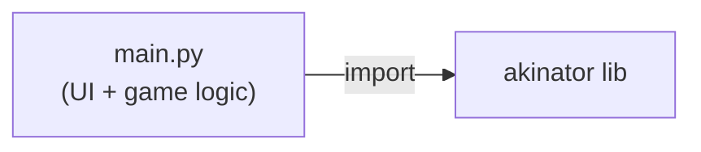
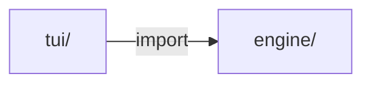
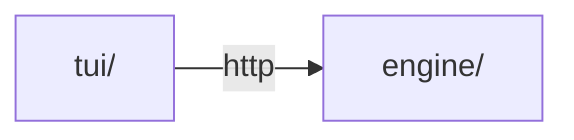
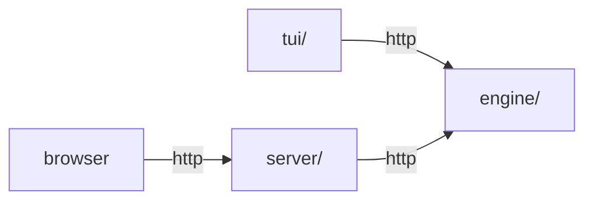

# akin

Bringing the Akinator experience to the terminal. (And hopefully to a clean interface in the browser someday.)

## Architecture

The project is built in phases, each adding a layer while keeping the previous one intact as a reference.

**PoC** – single file, no separation of concerns ([`poc` tag](https://github.com/yamcodes/akin/tree/poc)):

**Phase 1** – TUI talks directly to the engine via Python import:

**Phase 2** – engine gains an HTTP interface, TUI talks to it over HTTP:

**Phase 3** – browser client added; `server/` sits in front of `engine/` to serve hypermedia:

The engine only ever wraps the akinator library – it has no awareness of who is calling it.

## Structure

| Directory | Description                                        |
|-----------|----------------------------------------------------|
| `engine/` | Python wrapper around the akinator library         |
| `tui/`    | Frontend (Textual)                                 |
| `server/` | Spring Boot server, hypermedia, session state      |

## Acknowledgements

- Thanks [fiorix](https://gist.github.com/fiorix) for original gist: https://gist.github.com/fiorix/3152830
- Thanks [Omkaar](https://github.com/Ombucha) for the [`akinator`](https://github.com/Ombucha/akinator.py) library, which powers the game session and Cloudflare bypass
