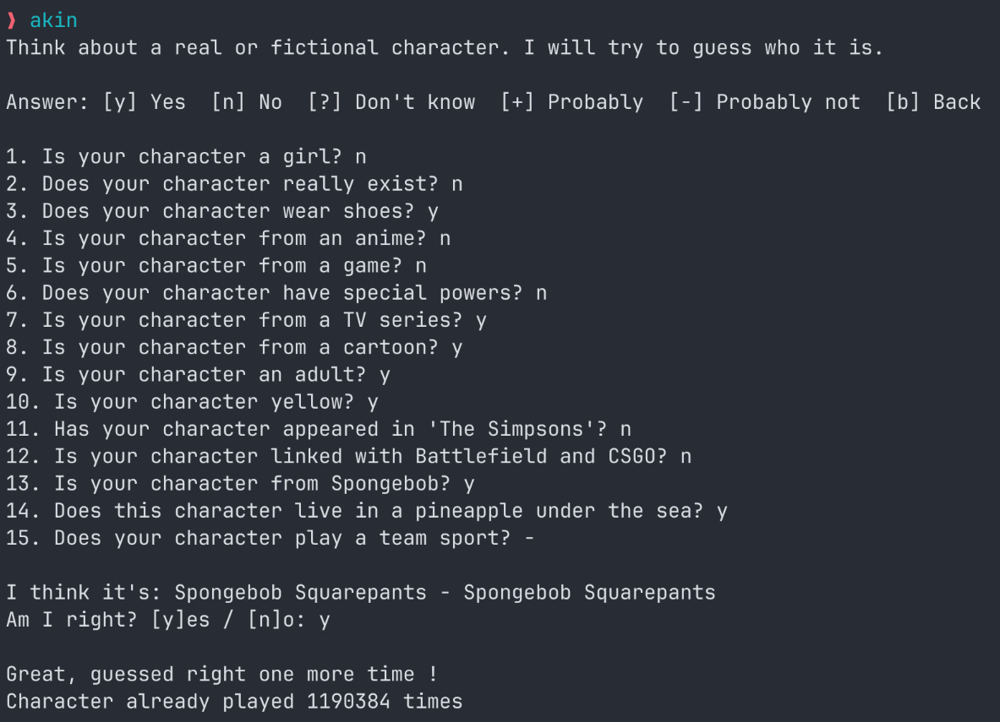
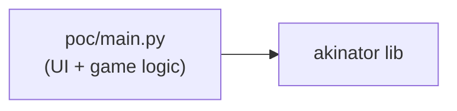
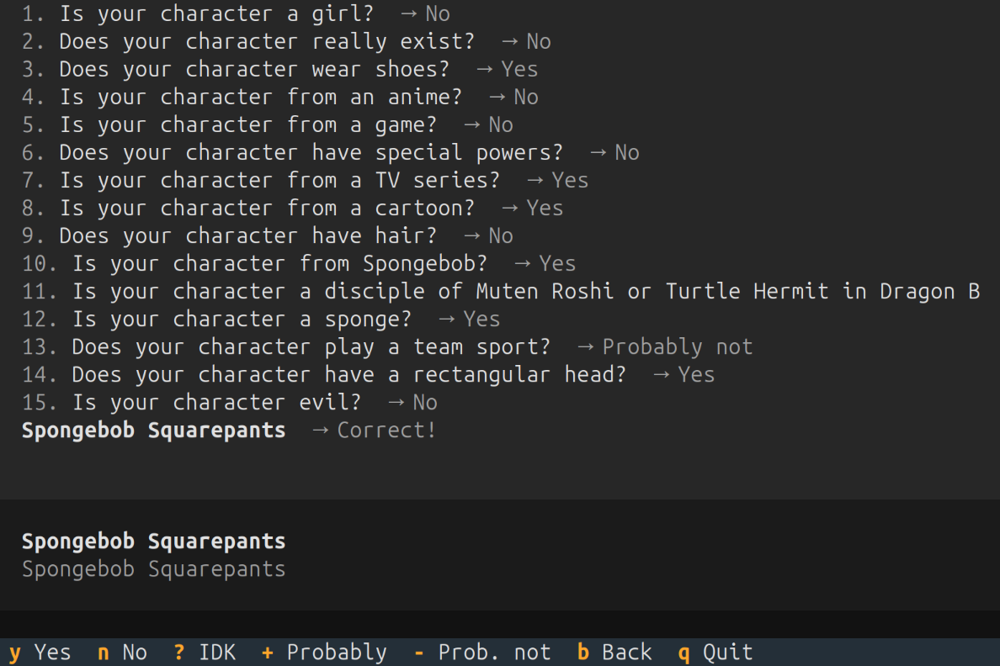
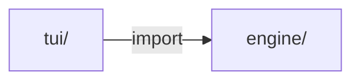
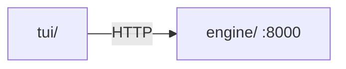
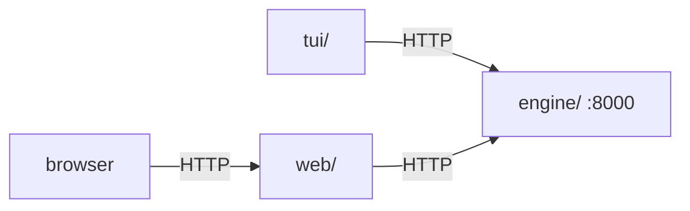

# akin

[](https://github.com/yamcodes/akin/blob/main/LICENSE)
[](https://scalar.com/)
[](https://github.com/yamcodes/akin/stargazers/)

Bringing the Akinator experience to the terminal – and eventually to the browser.

## Prerequisites

| Tool                                                      | Required for                |
|-----------------------------------------------------------|-----------------------------|
| [uv](https://docs.astral.sh/uv/)                          | all targets                 |
| [Docker](https://docs.docker.com/get-started/get-docker/) | `make docker`, `make start` |
| [curl](https://curl.se/)                                  | `make start`                |

## Quick start

```bash
make setup    # install deps for both services (one-time)

make start                    # full stack: engine (Docker) + TUI
make start ARGS="es"          # same, Spanish
make start ARGS="en --debug"  # same, with debug info
```

Or run services separately:

```bash
# Dockerless (two terminals)
make engine     # Terminal 1 - engine on :8000
make tui        # Terminal 2 - TUI

# Docker engine + native TUI (two terminals)
make docker     # Terminal 1 - engine via Docker Compose
make tui        # Terminal 2 - TUI
```

Run `make` (no target) to see all available targets.

Once the engine is running, the interactive API docs are at **http://localhost:8000**.

## Architecture

The project is built in phases, each adding a layer while keeping the previous one intact as a reference.

### Phase 0: Proof of concept

[Single `main.py` file](https://github.com/yamcodes/akin/blob/poc/main.py) - all UI and game logic in one file.





### Phase 1: Engine–UI separation

[`phase1`](https://github.com/yamcodes/akin/tree/phase1) - `engine/` and `tui/` as Python packages; TUI imports the engine directly. This phase exists mainly as a setup for phase 2.





### Phase 2: HTTP communication ← current
[`phase2`](https://github.com/yamcodes/akin/tree/phase2) - Engine and TUI are independent services (separate `uv` projects).
They communicate over HTTP. Engine ships as a Docker image.


**Cloudflare note:** akinator.com is behind Cloudflare. The engine uses [`curl-cffi`](https://github.com/yifeikong/curl-cffi) to impersonate Chrome's TLS fingerprint, which passes bot detection reliably in any environment including Docker. The `akinator` library's default (`cloudscraper`) only solves JS challenges but leaves Python's TLS fingerprint exposed, causing 403 errors in containers.



### Phase 3: TUI distribution

TUI is packaged as a proper Python package and distributed via Homebrew.
Requires converting `tui/` from a flat-module layout to a real package (`akin_tui/`)
so that non-Python assets (e.g. `app.tcss`) are included in the wheel.

### Phase 4: Hypermedia

A `web/` server is added for browser clients.
The engine has no awareness of who is calling it.



## Repository layout

| Path                 | Description                                                   |
|----------------------|---------------------------------------------------------------|
| `engine/`            | Game logic + FastAPI HTTP server ([README](engine/README.md)) |
| `tui/`               | Textual TUI client ([README](tui/README.md))                  |
| `poc/`               | Original single-file proof of concept                         |
| `web/`               | Spring Boot hypermedia server (Phase 4, not yet implemented)  |
| `docker-compose.yml` | Starts the engine service                                     |

## Acknowledgements

- [fiorix](https://gist.github.com/fiorix) for the [akinator.py gist](https://gist.github.com/fiorix/3152830) that inspired this project
- [Ombucha](https://github.com/Ombucha) for the [akinator.py library](https://github.com/Ombucha/akinator.py) that powers the engine
