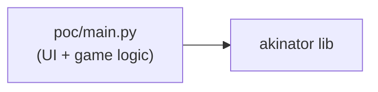
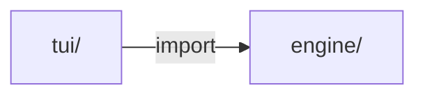
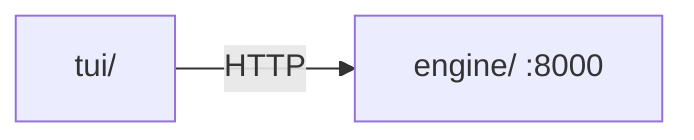
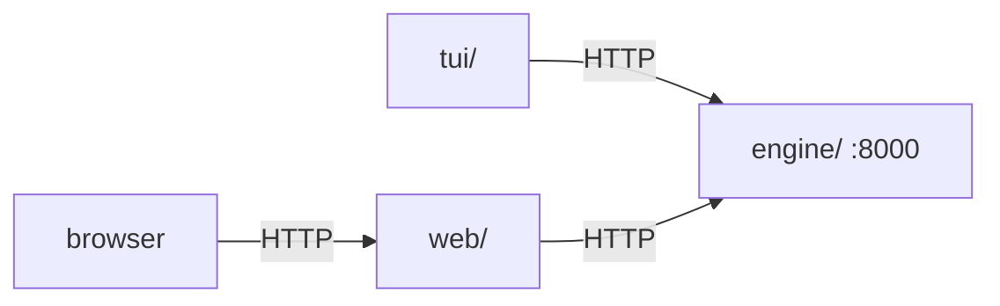

# akin

Bringing the Akinator experience to the terminal — and eventually to the browser.

## Quick start

```bash
# Terminal 1 — start the engine
cd engine && uv sync && uv run python server.py

# Terminal 2 — start the TUI
cd tui && uv sync && uv run python main.py
```

Or with Docker:

```bash
docker compose up          # starts the engine on :8000
cd tui && uv run python main.py
```

## Architecture

The project is built in phases, each adding a layer while keeping the previous one intact as a reference.

### Phase 0: Proof of concept

[Single `poc/main.py`](poc/main.py) — UI and game logic in one file.



### Phase 1: Engine–UI separation

`engine/` and `tui/` as Python packages; TUI imports the engine directly.



### Phase 2: HTTP communication ← current

Engine and TUI are independent services (separate `uv` projects).
They communicate over HTTP. Engine ships as a Docker image; TUI distributes via Homebrew.

**Cloudflare note:** akinator.com is behind Cloudflare. The engine uses [`curl-cffi`](https://github.com/yifeikong/curl-cffi) to impersonate Chrome's TLS fingerprint, which passes bot detection reliably in any environment including Docker. The `akinator` library's default (`cloudscraper`) only solves JS challenges but leaves Python's TLS fingerprint exposed, causing 403s in containers.



### Phase 3: Hypermedia

A `web/` server is added for browser clients.
The engine has no awareness of who is calling it.



## Repository layout

| Path | Description |
|------|-------------|
| `engine/` | Game logic + FastAPI HTTP server ([README](engine/README.md)) |
| `tui/` | Textual TUI client ([README](tui/README.md)) |
| `poc/` | Original single-file proof of concept |
| `web/` | Spring Boot hypermedia server (Phase 3, not yet implemented) |
| `docker-compose.yml` | Starts the engine service |

## Acknowledgements

- [fiorix](https://gist.github.com/fiorix) for the [akinator.py gist](https://gist.github.com/fiorix/3152830) that inspired this project
- [Ombucha](https://github.com/Ombucha) for the [akinator.py library](https://github.com/Ombucha/akinator.py) that powers the engine
