# akin

Bringing the Akinator experience to the terminal. (And hopefully to a clean interface in the browser someday.)

## Architecture

The project is built in phases, each adding a layer while keeping the previous one intact as a reference.

### Phase 0: Proof of Concept

[Single `main.py` file](https://github.com/yamcodes/akin/blob/poc/main.py), no separation of concerns.

### Phase 1: Engine-UI separation

[`engine/` + `tui/`](https://github.com/yamcodes/akin/tree/phase1), TUI talks directly to the engine via Python import.

### Phase 2: HTTP communication

Engine gains an HTTP interface, TUI talks to it over HTTP.
Engine and TUI are independent `uv` projects (separate `pyproject.toml` / `uv.lock`).
Engine ships as a Docker image deployable to Railway; TUI distributes via Homebrew.

### Phase 3: Hypermedia

`web/` added to serve the browser (hypermedia); browser is just Chrome/Firefox, no dedicated repo code:

```mermaid
graph LR
    tui["tui/"] --http--> engine["engine/"]
    browser["🌐 browser"] --http--> web["web/"] --http--> engine["engine/"]
```

The engine only ever wraps the akinator library – it has no awareness of who is calling it.

## Structure

| Directory | Description                                        |
|-----------|----------------------------------------------------|
| `engine/` | Python wrapper around the akinator library         |
| `tui/`    | Frontend (Textual)                                 |
| `web/`    | Spring Boot server, hypermedia, session state      |

## Acknowledgements

- Thanks [fiorix](https://gist.github.com/fiorix) for the [akinator.py gist](https://gist.github.com/fiorix/3152830) which inspired this project
- Thanks [Omkaar](https://github.com/Ombucha) for the [akinator.py library](https://github.com/Ombucha/akinator.py) which powers the game engine